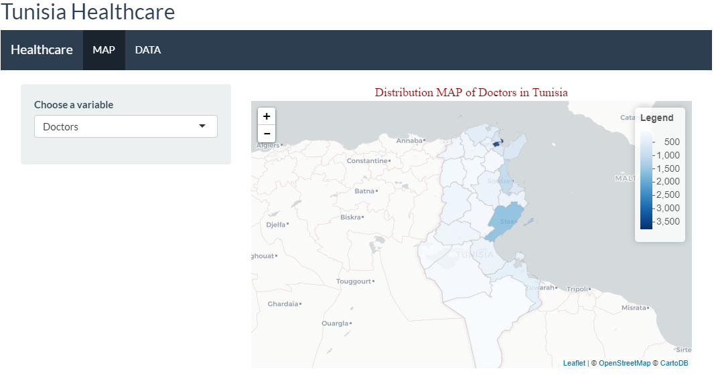

# hctn
## Description
This package allow you to see from a Shiny application the distribuation of variables (nb of beds , nbr of doctors ,...) thanks to an interactive MAP of Tunisia.

## Installation 
1- First, you need to install the devtools package. You can do this from CRAN. Invoke R and then type
```
install.packages("devtools")
```
2- Load the devtools package
```
library(devtools)
```
3- Install **htcs** from github
```
install_github("AhmedSaad95/hctn")
```
## Dependencies
```
library(shiny)
library(shinythemes)
library(DT)
library(leaflet)
library(RColorBrewer)
library(readr)
```
## capture
<p align="center">

</p>
